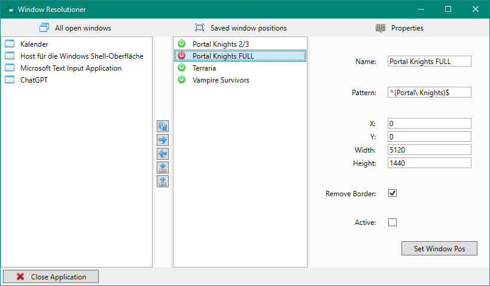
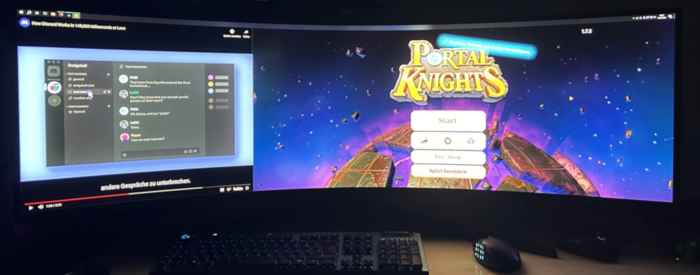

# Window Resolutioner

Window Resolutioner is a utility program designed for Windows users with ultra-wide screens who wish to manage window positioning for gaming and multitasking purposes. It allows users to customize and save window positions, enabling seamless integration of gaming and other activities on their monitors.

## Motivation

The motivation behind Window Resolutioner stemmed from the challenge of managing window positions on ultra-wide screens while gaming and multitasking. Traditional fullscreen modes often disrupt other activities on the screen, leading to a less than optimal user experience. This program aims to provide a solution by offering a flexible and customizable way to manage window positions.

## Key Features

- Customizable window positioning: Users can define specific positions for windows on their screen, allowing for a tailored layout that suits their preferences.
- Automatic window management: Window Resolutioner continuously monitors and adjusts window positions based on user-defined settings, ensuring a consistent layout during usage.
- Regex pattern matching: Users can specify window titles or parts of titles using regex patterns, enabling precise targeting of windows for positioning adjustments.
- Border removal option: Users have the option to remove window borders for a cleaner and more streamlined appearance.

## System Requirements

- Operating System: Windows
- Dependencies: .NET (NET8) runtime

## Installation

1. Download the MSI setup file from the [RELEASES](https://github.com/derDere/window-resolutioner/releases/) page.
2. Run the setup wizard and follow the on-screen instructions to install Window Resolutioner on your system.

## Usage

1. Launch Window Resolutioner.
2. Select a window you wish to manage.
3. Customize the regex pattern if needed.
4. Set the desired position values (X, Y, width, height).
5. Activate the positioning or manually apply it once.
6. Save the configuration.

## License

Window Resolutioner is released under the GNU GENERAL PUBLIC LICENSE Version 3. See the [LICENSE](LICENSE) file for more details.

## Contributing

Window Resolutioner is an open-source project hosted on GitHub. Contributions are welcome in the form of bug reports, feature suggestions, or code contributions. Please refer to the [CONTRIBUTING](CONTRIBUTING.md) file for more information on how to contribute.

## Example Usage

In the following photo is an example where this tool is used to force the game "Portal Knight" into a borderless "fullscreen"-mode that only take two thirds of the screen. It is done by configuring the game to just run in windowed mode. That means it will be a bordered window with a fixed size. The tool is now configured to look for all windows that match the pattern '''^(Portal\ Knights)$''' and then for all matching windows to remove the window border and place it at X: 1700, Y: 40 with a Width: 3440 and a Height: 1400. Now the positioning is activated and saved by the '''Save Positions''' button. (Its the second to bottom button in the central button column.) From now on if the Window-Resolutioner is running the game "Portal Knights" will always be resized to this position of the screen.

